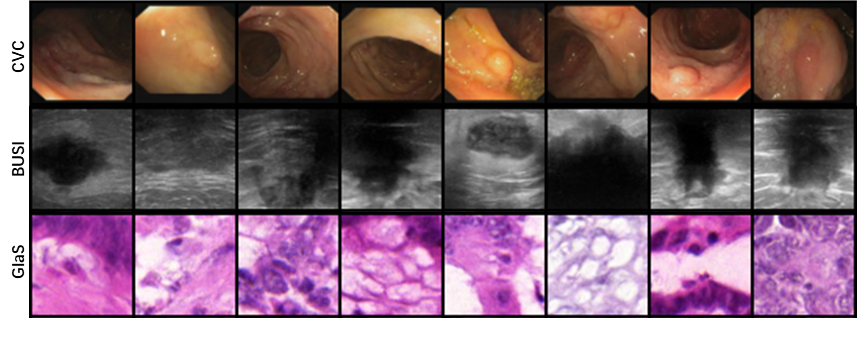

# Diffusion UKAN (arxiv)

> [**U-KAN Makes Strong Backbone for Medical Image Segmentation and Generation**](https://arxiv.org)<br>
> [Chenxin Li](https://xggnet.github.io/)\*, [Xinyu Liu](https://xinyuliu-jeffrey.github.io/)\*, [Wuyang Li](https://wymancv.github.io/wuyang.github.io/)\*, [Cheng Wang](https://scholar.google.com/citations?user=AM7gvyUAAAAJ&hl=en)\*, [Hengyu Liu](), [Yixuan Yuan](https://www.ee.cuhk.edu.hk/~yxyuan/people/people.htm)<sup>✉</sup><br>The Chinese Univerisity of Hong Kong

Contact: wuyangli2-c@my.cityu.edu.hk 

## 💡 Environment 
You can change the torch and Cuda versions to satisfy your device.
```bash
conda create --name UKAN python=3.10
conda activate UKAN
conda install cudatoolkit=11.3
pip install -r requirement.txt
```

## 🖼️ Gallery of Diffusion UKAN 



## 📚 Prepare datasets
Download the pre-processed dataset from [Onedrive](https://gocuhk-my.sharepoint.com/:u:/g/personal/wuyangli_cuhk_edu_hk/ESqX-V_eLSBEuaJXAzf64JMB16xF9kz3661pJSwQ-hOspg?e=XdABCH) and unzip it into the project folder. The data is pre-processed by the scripts in [tools](./tools).
```
data
└─ cvc
    └─ images_64
└─ busi
    └─ images_64
└─ glas
    └─ images_64
```
## 📦 Prepare pre-trained models

Download released_models from [Onedrive](https://gocuhk-my.sharepoint.com/:u:/g/personal/wuyangli_cuhk_edu_hk/EUVSH8QFUmpJlxyoEj8Pr2IB8PzGbVJg53rc6GcqxGgLDg?e=a4glNt) and unzip it in the project folder.
```
released_models
└─ ukan_cvc
    └─ FinalCheck   # generated toy images (see next section)
    └─ Gens         # the generated images used for evaluation in our paper
    └─ Tmp          # saved generated images during model training with a 50-epoch interval
    └─ Weights      # The final checkpoint
    └─ FID.txt      # raw evaluation data 
    └─ IS.txt       # raw evaluation data  
└─ ukan_busi
└─ ukan_glas
```
## 🧸 Toy example
Images will be generated in `released_models/ukan_cvc/FinalCheck` by running this:

```python
python Main_Test.py
```
## 🔥 Training
<!-- You may need to modify the dirs slightly. -->
Please refer to the [training_scripts](./training_scripts) folder. Besides, you can play with different network variations by modifying `MODEL` according to the following dictionary,

```python
model_dict = {
    'UNet': UNet,
    'UNet_ConvKan': UNet_ConvKan,
    'UMLP': UMLP,
    'UKan_Hybrid': UKan_Hybrid,
    'UNet_Baseline': UNet_Baseline,
}
```


## 🤞 Acknowledgement 
Thanks for 
We mainly appreciate these excellent projects
- [Simple DDPM](https://github.com/zoubohao/DenoisingDiffusionProbabilityModel-ddpm-) 
- [Kolmogorov-Arnold Network](https://github.com/mintisan/awesome-kan) 
- [Efficient Kolmogorov-Arnold Network](https://github.com/Blealtan/efficient-kan.git) 
